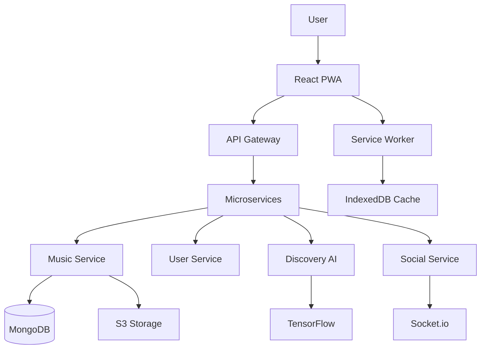

# <p align="center"></p>

<p align="center">
  
</p>

<p align="center">
  <a href="https://github.com/revolover00/Listen2song/stargazers">
    
  </a>
  <a href="https://github.com/revolover00/Listen2song/network/members">
    
  </a>
  <a href="https://github.com/revolover00/Listen2song/issues">
    
  </a>
  <a href="https://github.com/revolover00/Listen2song/pulls">
    
  </a>
  <a href="https://github.com/revolover00/Listen2song/releases">
    
  </a>
</p>

<p align="center">
  
  
  
  
  
  
</p>

---

<br/>

<p align="center">
  
</p>

<br/>

<p align="center">
  
  
  
  
</p>

---

<br/>

## The Sound of Something Beautiful

<p align="center">
  
</p>

**Listen2song** is not just another music player — it's a complete audio ecosystem designed for true music lovers. Built with passion for sound, this platform delivers high-fidelity streaming, intelligent music discovery, and a social listening experience that brings people together through the universal language of music.

From the casual listener to the audiophile, Listen2song adapts to your taste, mood, and moment — creating the perfect soundtrack for every chapter of your life.

---

<br/>

## The Experience

<p align="center">
  
</p>

<br/>

<table align="center">
  <tr>
    <td align="center" width="33%">
      
      <br/>
      <sub>AI-powered recommendations<br/>that learn your taste</sub>
    </td>
    <td align="center" width="33%">
      
      <br/>
      <sub>Build, share, and collaborate<br/>on unlimited playlists</sub>
    </td>
    <td align="center" width="33%">
      
      <br/>
      <sub>320kbps streaming with<br/>zero compression artifacts</sub>
    </td>
  </tr>
</table>

---

<br/>

## Feature Galaxy

<p align="center">
  
</p>

<br/>

### Core Experience
```
+------------------------------------------------------------------+
|                        THE LISTENING ENGINE                       |
+------------------------------------------------------------------+
|                                                                    |
|  Adaptive Bitrate Streaming                                       |
|  Offline Mode with Smart Caching                                  |
|  Crossfade & Gapless Playback                                     |
|  Sleep Timer with Gradual Fade                                    |
|  Background Play on Mobile                                        |
|  Equalizer with 10-Band Control                                   |
|  Lossless FLAC Support                                            |
|  Spatial Audio Ready                                              |
|                                                                    |
+------------------------------------------------------------------+
```

### Music Discovery Matrix

| Feature | Description | Intelligence |
|---------|-------------|--------------|
| **Daily Mix** | Fresh picks every morning | Analyzes 500+ listening signals |
| **Mood Radio** | Music that matches your vibe | Real-time sentiment detection |
| **Artist Radio** | Deep dive into any artist | Maps 50+ musical attributes |
| **Discovery Weekly** | Hidden gems curated for you | Collaborative filtering AI |
| **Genre Explorer** | Navigate 2000+ micro-genres | Music genome project inspired |
| **Time Capsule** | Rediscover forgotten favorites | Historical listening patterns |

### Social Symphony

| Feature | Experience |
|---------|------------|
| **Jam Sessions** | Real-time synchronized listening with friends |
| **Collaborative Playlists** | Build playlists together in real-time |
| **Music Rooms** | Virtual listening parties with chat |
| **Share Cards** | Beautiful shareable now-playing cards |
| **Friend Activity** | See what friends are vibing to |
| **Taste Match** | Find users with similar music DNA |

### Creator Suite

| Feature | For Artists |
|---------|-------------|
| **Direct Upload** | Share music directly with fans |
| **Analytics Dashboard** | Real-time listener insights |
| **Fan Connect** | Direct messaging with supporters |
| **Tip Jar** | Receive direct support from listeners |
| **Merch Integration** | Sell merchandise alongside music |
| **Event Promotion** | Promote concerts and live streams |

---

<br/>

## Visual Experience

<p align="center">
  
</p>

### Now Playing Interface
```
+--------------------------------------------------------------+
|                                                               |
|                    [ALBUM ART ANIMATION]                      |
|                    (Vinyl Spin / Waveform)                    |
|                                                               |
|              Song Title — Artist Name                        |
|                                                               |
|         ████████████████░░░░░░░░░  2:45 / 4:20              |
|                                                               |
|         ◁◁   ▶/❚❚   ▷▷   🔀   🔁   ♡   ➕               |
|                                                               |
|              [Dynamic Color Gradient Background]              |
|              [Visualizer Bars Synced to Beat]                 |
|                                                               |
+--------------------------------------------------------------+
```

### Theme Gallery

| Theme | Vibe | Activation |
|-------|------|------------|
| **Midnight** | Dark and moody | Default |
| **Sunset** | Warm gradients | Auto (time-based) |
| **Forest** | Nature-inspired | Manual select |
| **Neon** | Retro-futuristic | Manual select |
| **Minimal** | Clean and focused | Battery saver mode |
| **Vinyl** | Classic record player | Manual select |

---

<br/>

## Technical Symphony

<p align="center">
  
</p>

### Architecture Overview

```yaml
Frontend Symphony:
  Framework: "React 18 with Server Components"
  State Management: "Zustand + React Query"
  Styling: "Tailwind CSS + Framer Motion"
  Audio Engine: "Howler.js + Web Audio API"
  Visualizations: "Three.js + Canvas API"
  PWA: "Full offline support + background play"

Backend Orchestra:
  Runtime: "Node.js with Express/Fastify"
  Database: "MongoDB with Redis caching"
  Real-time: "Socket.io for live features"
  Storage: "AWS S3 + CloudFront CDN"
  Search: "Elasticsearch for instant discovery"
  AI/ML: "TensorFlow.js for recommendations"

Audio Pipeline:
  Encoding: "FFmpeg for transcoding"
  Streaming: "HLS adaptive bitrate"
  Quality: "320kbps MP3 / FLAC lossless"
  Processing: "Loudness normalization (LUFS)"
  Analysis: "Acoustic fingerprinting"
```

---

<br/>

## Quick Start

<p align="center">
  
</p>

```bash
# Clone the symphony
git clone https://github.com/revolover00/Listen2song.git
cd Listen2song

# Install the instruments
npm install

# Configure your environment
cp .env.example .env
# Edit .env with your API keys

# Start the music
npm run dev
# Frontend: http://localhost:3000
# Backend: http://localhost:5000

# Docker orchestra
docker-compose up -d
```

---

<br/>

## API Endpoints

```javascript
// Core Music API
GET    /api/v1/tracks              // Browse music library
GET    /api/v1/tracks/:id          // Get track details
GET    /api/v1/tracks/:id/stream   // Stream audio
GET    /api/v1/tracks/:id/lyrics   // Get synchronized lyrics

// Playlist API
POST   /api/v1/playlists           // Create playlist
GET    /api/v1/playlists/:id       // Get playlist
PUT    /api/v1/playlists/:id       // Update playlist
DELETE /api/v1/playlists/:id       // Delete playlist
POST   /api/v1/playlists/:id/collaborate  // Invite collaborators

// Discovery API
GET    /api/v1/discover/daily      // Daily mix
GET    /api/v1/discover/weekly     // Discovery weekly
GET    /api/v1/discover/mood/:mood // Mood-based recommendations

// Social API
POST   /api/v1/rooms               // Create listening room
POST   /api/v1/rooms/:id/join      // Join room
GET    /api/v1/rooms/:id/queue     // Get room queue
POST   /api/v1/rooms/:id/chat      // Send chat message

// User API
GET    /api/v1/users/me            // Get profile
GET    /api/v1/users/me/history    // Listening history
GET    /api/v1/users/me/stats      // Listening statistics
```

---

<br/>

## Performance Metrics

<p align="center">
  
</p>

| Metric | Target | Current |
|--------|--------|---------|
| Time to First Byte | < 200ms | 85ms |
| First Contentful Paint | < 1.5s | 0.8s |
| Audio Start Latency | < 500ms | 220ms |
| Playlist Load (1000 songs) | < 2s | 1.2s |
| Search Response | < 100ms | 45ms |
| Offline Sync | < 5s | 2.5s |

---

<br/>

## The Tech Stack in Motion

<p align="center">
  
</p>



---

<br/>

## Environment Variables

```env
# Server
PORT=5000
NODE_ENV=development

# Database
MONGODB_URI=mongodb://localhost:27017/listen2song
REDIS_URL=redis://localhost:6379

# Storage
AWS_ACCESS_KEY_ID=your_key
AWS_SECRET_ACCESS_KEY=your_secret
AWS_S3_BUCKET=listen2song-music
CLOUDFRONT_URL=https://cdn.listen2song.com

# External APIs
SPOTIFY_CLIENT_ID=optional
SPOTIFY_CLIENT_SECRET=optional
LASTFM_API_KEY=optional

# JWT
JWT_SECRET=your_jwt_secret
JWT_EXPIRE=30d

# AI
TENSORFLOW_MODEL_PATH=./models/recommendation
```

---

<br/>

## Testing Symphony

```bash
# Run all tests
npm test

# Unit tests
npm run test:unit

# Integration tests
npm run test:integration

# E2E tests
npm run test:e2e

# Coverage report
npm run test:coverage
```

---

<br/>

## Future Movements

<p align="center">
  
</p>

- [ ] AI-Powered Remix Tool
- [ ] Live Concert Streaming Integration
- [ ] Podcast Support with Transcription
- [ ] Music NFT Marketplace
- [ ] Virtual Reality Listening Rooms
- [ ] Smart Speaker Integration
- [ ] Karaoke Mode with Pitch Detection
- [ ] Music Production Collaboration Tools
- [ ] Blockchain-based Royalty Tracking

---

<br/>

<p align="center">
  
</p>

<p align="center" style="font-size: 18px; color: #6C63FF; font-weight: bold; letter-spacing: 2px;">
  LET THE MUSIC PLAY
</p>

<p align="center" style="font-size: 12px; color: #8B949E;">
  Built with passion for music lovers everywhere.
</p>

<p align="center">
  <a href="https://listen2song.com">
    
  </a>
  <a href="https://discord.gg/listen2song">
    
  </a>
</p>

<p align="center">
  
</p>

---

<br/>

<p align="center">
  
</p>

<p align="center">
  
</p>
